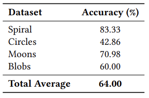

# PANet

## Model

PANet (Point-Attention Network) combines:
- Point-wise MLP for local feature extraction
- Multi-head attention to capture global relationships
- Global pooling
- Final prediction via MLP

## Dataset

The datasets consist of spiral, circles, moons, and blobs.

- [X_train.npy](./datasets/X_train.npy) (800, 500, 2), [X_valid.npy](./datasets/X_valid.npy) (100, 500, 2), [X_test.npy](./datasets/X_test.npy) (100, 500, 2): 2D point distributions

- [y_train.npy](./datasets/y_train.npy) (800, 500, 6), [y_valid.npy](./datasets/y_valid.npy) (100, 500, 6), [y_test.npy](./datasets/y_test.npy) (100, 500, 6): the number of clusters / one-hot encoding

- [y_train_clustering.npy](./datasets/y_train_clustering.npy) (800, 500, 2), [y_valid_clustering.npy](./datasets/y_valid_clustering.npy) (100, 500, 2), [y_test_clustering.npy](./datasets/y_test_clustering.npy) (100, 500, 2): clustering label for each point

## Results

  

PANet achieved 64.0% accuracy in diverse 2D distributions. This table also shows the accuracy for each structure. PANet performs particularly well on the spiral(83.3%) and moons(71.0%) datasets.

To benchmark PANet, we compared it against the Silhouette and  Elbow. While heuristic methods distributed probability evenly across all cluster counts, PANet produced confident predictions, often assigning over 85% probability to the correct number of clusters. This heatmap clearly illustrates PANet’s performance in distinguishing the true cluster count from alternatives.

## Run

You can run [PANet model](./model.py), using [pre-trained weights](./PANet.pt) right now. And we also offer the [Conda enviroment file](./environment.yml).
